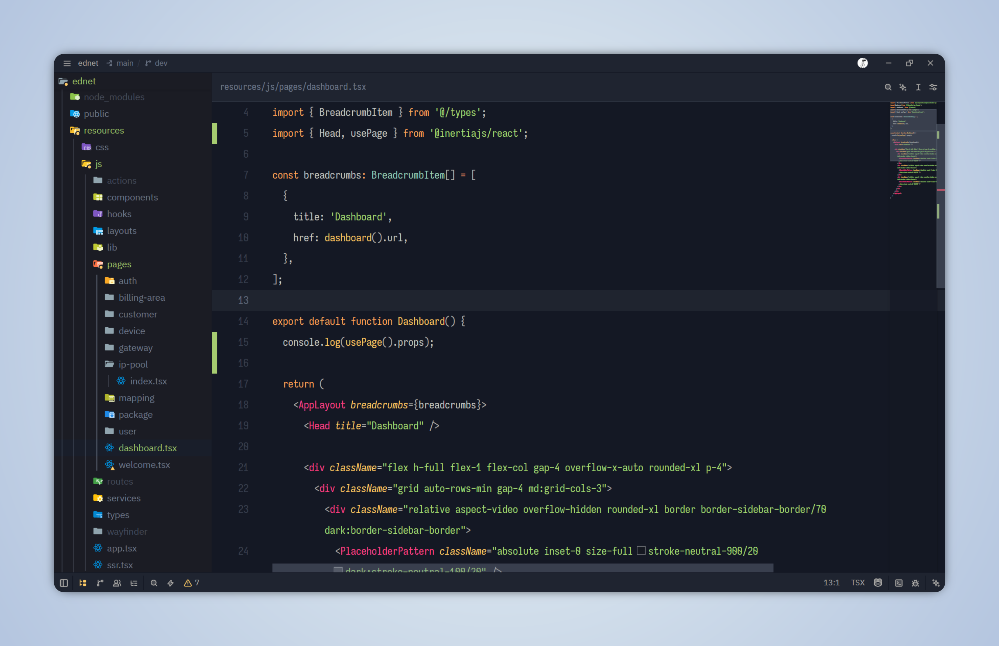

# Mayukai Zed

A port of the [Mayukai Theme](https://github.com/GulajavaMinistudio/Mayukai-Theme) for the [Zed](https://zed.dev) code editor.

> This port was created independently after submitting a Zed support request to the original repository that received no response. All credit for the original color design goes to [GulajavaMinistudio](https://github.com/GulajavaMinistudio).

---

## Variants

### Mayukai Sunset
A warm dark theme with golden and orange accents.


### Mayukai Midnight
A cooler dark theme with purple/violet accents, giving code a more distinct, moody feel.



---

## Installation

### Via Zed Extension Store *(coming soon)*

Search for **Mayukai** in Zed's extension panel (`cmd/ctrl + shift + x`) and install it directly.

### Manual Installation

1. Clone this repository:
   ```
   git clone https://github.com/irsyadulibad/mayukai-zed
   ```
2. Open Zed and go to **Extensions** (`cmd/ctrl + shift + x`)
3. Click **Install Dev Extension** and select the cloned folder

---

## Color Palette

Both variants share the same base UI colors, differing only in syntax highlighting.

### Shared UI Colors

| Role | Color |
|---|---|
| Editor Background | `#141824` |
| Panel / Sidebar Background | `#101521` |
| Widget / Popup Background | `#232834` |
| Foreground (Text) | `#CBCCC6` |
| Muted Text | `#707a8c` |
| Accent | `#ffcc66` |
| Cursor | `#ff4057` |

### Syntax — Sunset vs Midnight

| Token | Sunset | Midnight |
|---|---|---|
| Numbers | `#f27983` | `#d2a6ff` |
| Booleans / Constants | `#f28779` | `#dfbfff` |
| Types / Classes | `#95e6cb` | `#9CD1BB` |
| Built-in Functions | `#ffcc66` | `#F07178` |
| Keywords | `#ffa759` | `#ffa759` |
| Functions | `#ffcc66` | `#ffcc66` |
| Strings | `#A9DC76` | `#A9DC76` |
| Comments | `#5c6773` *(italic)* | `#5c6773` *(italic)* |
| Tags (HTML/JSX) | `#fc4085` | `#fc4085` |
| Operators | `#f29668` | `#f29668` |

---

## Credits

- **Original theme**: [Mayukai Theme](https://github.com/GulajavaMinistudio/Mayukai-Theme) by [GulajavaMinistudio](https://github.com/GulajavaMinistudio) — originally designed for VS Code, Sublime Text, and other editors.
- **Zed port**: [Ahmad Irsyadul Ibad](https://github.com/irsyadulibad)

---

## License

This project follows the license of the original Mayukai Theme. Please refer to the [original repository](https://github.com/GulajavaMinistudio/Mayukai-Theme) for license details.
